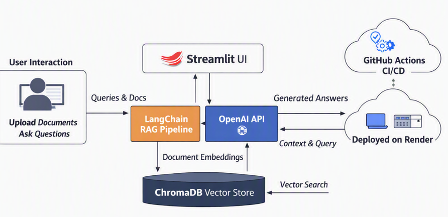
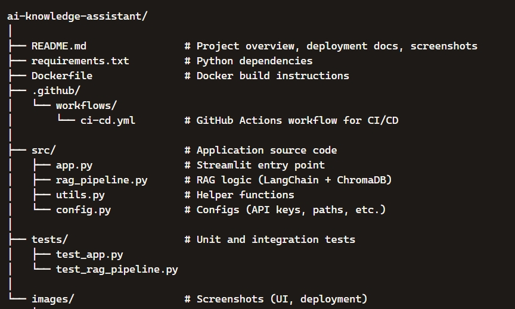

# 🤖 AI Knowledge Assistant
An end‑to‑end Retrieval‑Augmented Generation (RAG) application powered by Streamlit, LangChain, ChromaDB, and OpenAI. This project enables users to upload documents, query them in natural language, and receive context‑aware answers through a clean, intuitive interface.

It features a CI/CD pipeline with GitHub Actions for automated builds and testing, and is deployed seamlessly to Render using Docker images published to GitHub Container Registry (GHCR).

---
## 🏗️ Architecture Diagram


## 🔄 Data Flow

1. **User Interaction**
   - Users upload documents or submit queries via the Streamlit UI.

2. **Streamlit UI**
   - Captures input and forwards it to the backend RAG pipeline.

3. **LangChain RAG Pipeline**
   - Converts documents into embeddings.
   - Sends embeddings to ChromaDB for storage.
   - Retrieves relevant context from ChromaDB during queries.

4. **ChromaDB Vector Store**
   - Stores document embeddings.
   - Performs semantic vector search to return the most relevant chunks.

5. **OpenAI API**
   - Receives the query + retrieved context from LangChain.
   - Generates a contextual answer.

6. **Response Delivery**
   - Streamlit UI displays the generated answer back to the user.

7. **CI/CD & Deployment**
   - GitHub Actions builds and pushes Docker images to GHCR.
   - Render automatically redeploys the updated app.

---
## 🗂 Project Structure

---

## 🚀 Features
- Document ingestion: PDF, TXT, Markdown
- Chunking + embeddings with OpenAI
- Persistent vector store using ChromaDB
- Retrieval + generation pipeline with GPT
- Streamlit UI for easy interaction
- Full test coverage with pytest
- CI/CD pipeline with GitHub Actions
- Automatic deployment to Render via Docker

---
## ⚙️ Tech Stack
| **Component** | **Technology** | **Purpose** |
| --- | --- | --- |
| **Frontend** | [Streamlit](ca://s?q=Streamlit_framework_overview) | Interactive UI for document upload and Q&A |
| **Backend** | [Python](ca://s?q=Python_language_features) | Core logic and integration |
| **RAG Pipeline** | [LangChain](ca://s?q=LangChain_RAG_framework) | Retrieval‑Augmented Generation orchestration |
| **Vector Database** | [ChromaDB](ca://s?q=ChromaDB_vector_database) | Document embeddings and semantic search |
| **LLM API** | [OpenAI API](ca://s?q=OpenAI_API_usage) | Generates contextual answers |
| **CI/CD** | [GitHub Actions](ca://s?q=GitHub_Actions_CI_CD) | Automated build and deployment |
| **Hosting** | [Render](ca://s?q=Render_deployment_platform) | Cloud deployment for the Streamlit app |
| **Containerization** | [Docker](ca://s?q=Docker_containerization_basics) | Environment consistency and portability |
---

## 📖 Documentation Phases

- **Phase 01** → Streamlit UI setup (`app.py`)
- **Phase 02** → Backend wrappers (`retrieve.py`)
- **Phase 03** → RAG pipeline (`rag_pipeline.py`)
- **Phase 04** → Chroma index (`chroma_index.py`)
- **Phase 05** → CI/CD workflow (`deploy.yml`)
- **Phase 06** → Requirements documentation
- **Phase 07** → Project structure
- **Phase 08** → Architecture diagram
- **Phase 09** → Sequence diagram
- **Phase 10** → Deployment diagram
- **Phase 11** → Component & layered architecture

---

🧩 Setup Instructions

### 1️⃣ Clone the repository
git clone https://github.com/<your‑username>/ai‑knowledge‑assistant.git
cd ai‑knowledge‑assistant

### 2️⃣ Create a virtual environment
python -m venv venv
source venv/bin/activate   # macOS/Linux
venv\Scripts\activate      # Windows

### 3️⃣ Install dependencies
pip install -r requirements.txt

### 4️⃣ Configure environment variables
Create a `.env` file and add your keys:
OPENAI_API_KEY=your_api_key_here

### 5️⃣ Run the Streamlit app
streamlit run src/app.py

---

## 🧪 Application Screenshots

### Home Screen

### File Upload

### Chat Interface

### Docker Publish

### Render Deployed


---

## 🚀 Deployment

🔹 Docker Build & Run
```bash
# Build Docker image
docker build -t ai-knowledge-assistant .
# Run container locally
docker run -p 8501:8501 ai-knowledge-assistant

🔹 GitHub Actions CI/CD
CI/CD pipeline is defined in .github/workflows/ci-cd.yml.
On every push to main, GitHub Actions will:
Build the Docker image
Push it to GitHub Container Registry (GHCR)
Trigger deployment to Render

🔹 Render Deployment
Follow these steps to deploy your app on Render:
1. **Log in to Render**
   - Go to [Render](https://render.com) and sign in.
2. **Create a New Web Service**
   - Connect your GitHub repository.
3. **Configure Build Command**
   ```bash
   docker build -t ai-knowledge-assistant .
4. **Configure Start Command**
   Use the following command to launch the Streamlit app on Render:
   ```bash
   streamlit run src/app.py --server.port=$PORT --server.headless=true
5. **Set Environment Variables**  
   In the Render dashboard, go to **Environment → Add Environment Variables** and configure the following:

   - `OPENAI_API_KEY=your_api_key_here`  
     (required for connecting to the OpenAI API)
   - `PYTHON_VERSION=3.10`  
     (optional, ensures consistent runtime)
   - `STREAMLIT_SERVER_HEADLESS=true`  
     (ensures Streamlit runs in headless mode on Render)
   - `STREAMLIT_SERVER_PORT=$PORT`  
     (Render automatically injects the `$PORT` variable)
   Add any other secrets or configuration values your app requires.

6. **Deploy**  
   Once everything is configured:

   - Click **Create Web Service** in Render.  
   - Render will build your Docker image and start the service.  
   - The app will be accessible via your Render‑provided URL.  
   - Future pushes to the `main` branch will automatically trigger redeployment.  

