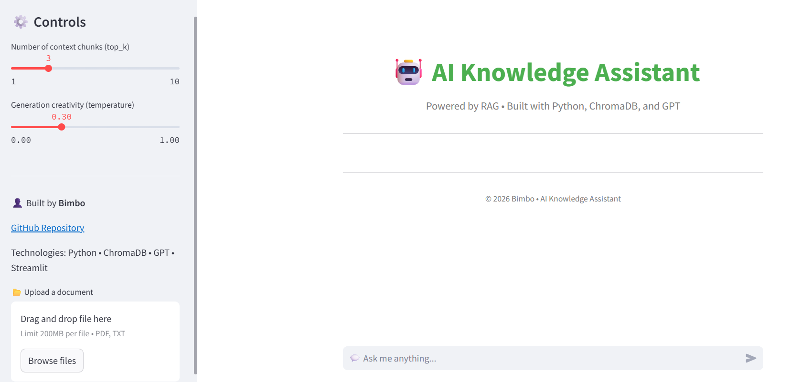
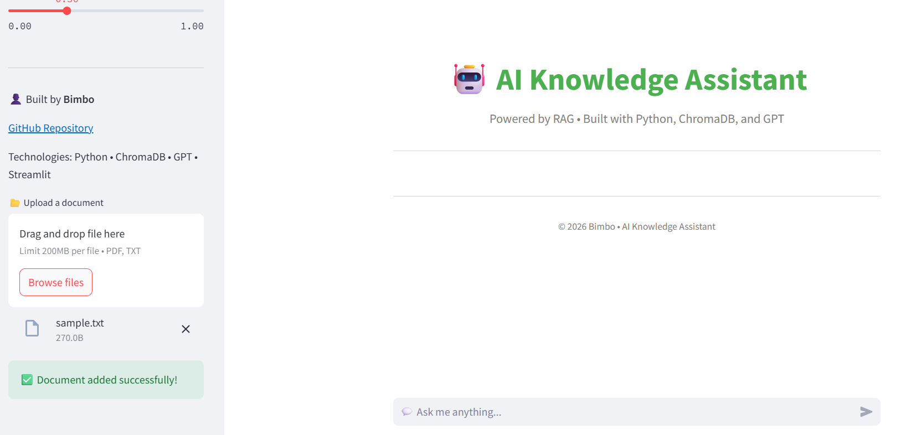
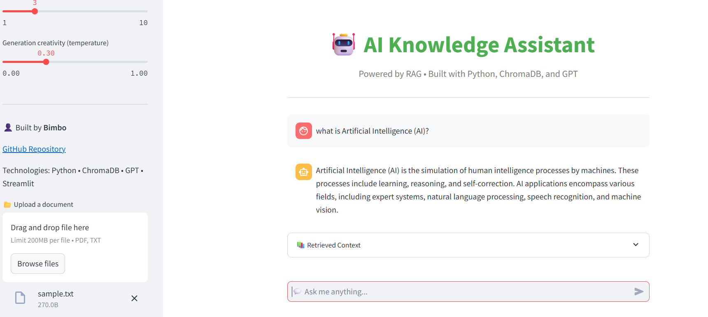
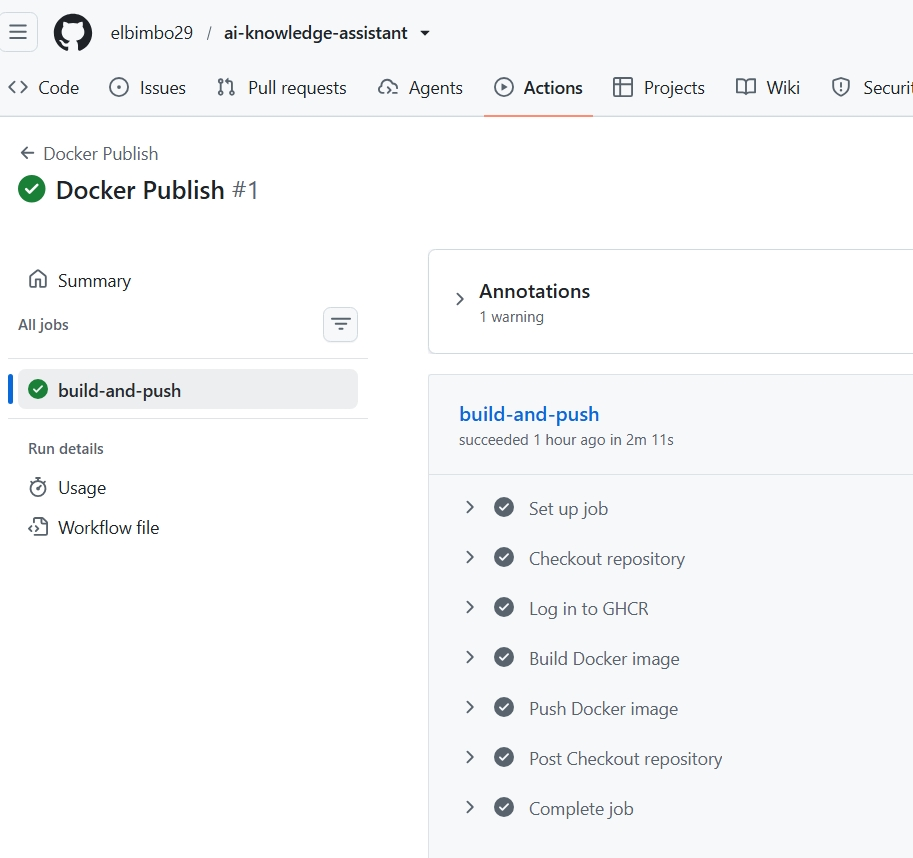
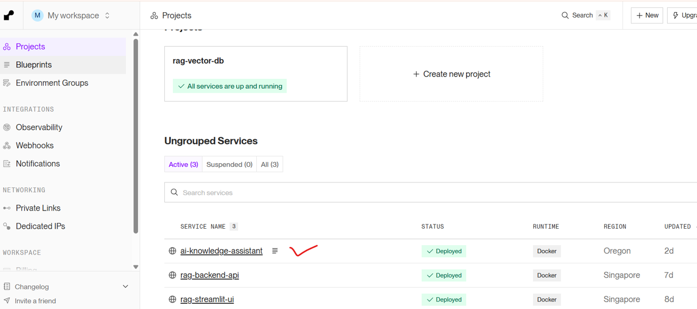

# 🤖 AI Knowledge Assistant
An end‑to‑end **Retrieval‑Augmented Generation (RAG)** application built with **Streamlit**, **LangChain**, **ChromaDB**, and **OpenAI**.  
It allows users to upload documents, query them via natural language, and receive context‑aware answers.

## 🗂 Project Structure
ai-knowledge-assistant/
│
├── app.py                 # Streamlit UI
├── requirements.txt       # Dependencies
├── Dockerfile             # Containerization
├── .dockerignore          # Docker exclusions
├── .github/workflows/     # CI/CD pipeline
│   └── deploy.yml
├── src/backend/           # Backend logic
│   ├── rag_pipeline.py    # Core RAG pipeline
│   ├── retrieve.py        # UI → Pipeline bridge
│   ├── chroma_index.py    # Direct ChromaDB access
│   └── init.py
├── tests/                 # Unit/integration tests
├── chroma_db/             # Persistent vector storage
└── README.md              # Documentation

---

## 🚀 Features
- Document ingestion: PDF, TXT, Markdown
- Chunking + embeddings with OpenAI
- Persistent vector store using ChromaDB
- Retrieval + generation pipeline with GPT
- Streamlit UI for easy interaction
- Full test coverage with pytest
- CI/CD pipeline with GitHub Actions
- Automatic deployment to Render via Docker

---

📖 Documentation Phases

Phase 01 → Streamlit UI setup (app.py)
Phase 02 → Backend wrappers (retrieve.py)
Phase 03 → RAG pipeline (rag_pipeline.py)
Phase 04 → Chroma index (chroma_index.py)
Phase 05 → CI/CD workflow (deploy.yml)
Phase 06 → Requirements documentation
Phase 07 → Project structure
Phase 08 → Architecture diagram
Phase 09 → Sequence diagram
Phase 10 → Deployment diagram
Phase 11 → Component & layered architecture

🧪 Testing
Run tests with:  pytest --maxfail=1 --disable-warnings -q

---

## Application Screenshots

### Home Screen

### File Upload

### Chat Interface

### Docker Publish

### Render Deployed

